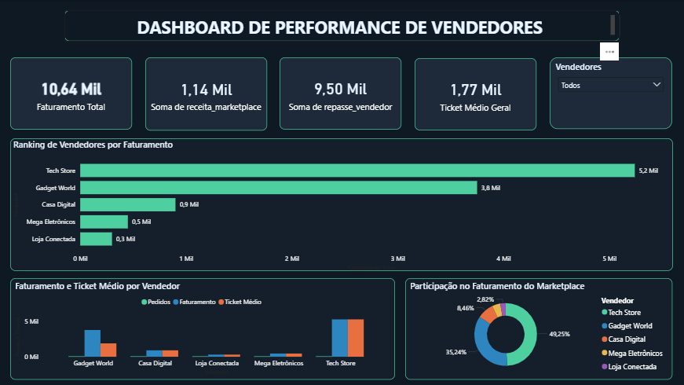

# Marketplace Analytics Project

Simulação de um ambiente de **Data Analytics para um marketplace**, utilizando PostgreSQL, SQL e Python para modelagem de dados, análises de negócio, criação de métricas estratégicas e pipeline de extração de dados.

O projeto demonstra práticas utilizadas por **analistas de dados**, incluindo modelagem relacional, cálculos de métricas de negócio, Window Functions, views analíticas para BI e pipeline de ETL com Python.

---

## 📌 Contexto de Negócio

Este projeto simula um **ecossistema de marketplace**, onde múltiplos vendedores comercializam produtos para clientes dentro de uma mesma plataforma.

Um dos principais desafios resolvidos na modelagem é a **integridade financeira do histórico de vendas**.

O preço de cada produto é registrado na tabela `itens_pedido` no momento da venda. Isso garante que:

- alterações futuras no preço do produto **não afetem vendas passadas**
- o histórico financeiro do marketplace permaneça **consistente**
- os relatórios financeiros sejam **auditáveis**

Esse padrão é utilizado em grandes plataformas como Amazon, Mercado Livre, Shopee e iFood.

---

## 🧱 Modelo de Dados

O banco de dados segue um modelo relacional típico de plataformas de e-commerce, composto pelas entidades: **clientes**, **vendedores**, **produtos**, **pedidos** e **itens_pedido**.

```text
clientes
--------
id_cliente (PK)
nome
email
cidade
      │
      │ 1:N
      ▼
pedidos
--------
id_pedido (PK)
id_cliente (FK)
data_pedido
      │
      │ 1:N
      ▼
itens_pedido
------------
id_item (PK)
id_pedido (FK)
id_produto (FK)
quantidade
preco_unitario
      │
      │ N:1
      ▼
produtos
--------
id_produto (PK)
nome_produto
id_vendedor (FK)
      │
      │ N:1
      ▼
vendedores
----------
id_vendedor (PK)
nome_vendedor
comissao_percentual
```

---

## 🛠️ Tecnologias Utilizadas

| Camada | Tecnologia |
|---|---|
| Banco de Dados | PostgreSQL |
| Linguagem SQL | SQL (DDL, DML, DQL) |
| Ferramenta SQL | pgAdmin |
| Linguagem Python | Python 3 |
| Bibliotecas Python | pandas, psycopg2 |
| Automação | Windows Batch Script (.bat) |
| BI | Power BI |

**Conceitos aplicados:**

- Modelagem Relacional
- DDL / DML / DQL
- JOINs, GROUP BY, Window Functions
- CTEs (Common Table Expressions)
- Views Analíticas
- Constraints de integridade referencial
- Pipeline de ETL com Python
- Logging estruturado
- Automação de execução via script `.bat`

---

## 📂 Estrutura do Projeto

```text
marketplace-analytics-sql
│
├── SQL
│   ├── 01_schema.sql
│   ├── 02_seed_data.sql
│   ├── 03_analytical_queries.sql
│   └── 04_views.sql
│
├── Python
│   └── pipeline_etl.py
│
├── assets
│   └── Dashboard_Final_Marketplace.png
│
├── Data
│   └── dados_performance_vendedores.csv  ← gerado localmente, não versionado
│
├── .gitignore
├── run_pipeline.bat
└── README.md
```

> **Nota:** A pasta `Data/` está listada no `.gitignore` e não é versionada no repositório. O arquivo `dados_performance_vendedores.csv` é gerado localmente ao executar o `pipeline_etl.py`.

### 01_schema.sql

Criação da estrutura do banco de dados: schema, tabelas, primary keys, foreign keys e constraints de integridade.

### 02_seed_data.sql

População do banco com dados simulados de marketplace: clientes, vendedores, produtos, pedidos e itens vendidos.

### 03_analytical_queries.sql

Consultas SQL para responder perguntas de negócio:

- Receita total do marketplace
- Receita e ranking de vendedores
- Produtos mais vendidos
- Clientes que mais gastaram
- Ticket médio por pedido
- Receita diária do marketplace

### 04_views.sql

Views analíticas que consolidam métricas para uso em dashboards de BI:

- GMV (Gross Merchandise Volume)
- Receita da plataforma (comissão)
- Repasse para vendedores
- Ticket médio por vendedor
- Ranking de vendedores por faturamento

### pipeline_etl.py

Pipeline de ETL que extrai dados do PostgreSQL via **psycopg2**, aplica transformações com **pandas** e exporta os resultados em CSV.

### run_pipeline.bat

Script de automação Windows que executa o pipeline com um duplo clique. Exibe feedback visual colorido (verde = sucesso, vermelho = erro), trata falhas com `errorlevel` e fecha automaticamente após 10 segundos em caso de sucesso.

---

## 🗄️ SQL — Exemplos de Análise

### Receita por vendedor

```sql
SELECT
    v.nome_vendedor,
    SUM(ip.quantidade * ip.preco_unitario) AS receita_vendedor
FROM vendedores v
JOIN produtos p ON v.id_vendedor = p.id_vendedor
JOIN itens_pedido ip ON p.id_produto = ip.id_produto
GROUP BY v.nome_vendedor
ORDER BY receita_vendedor DESC;
```

### Ticket médio por pedido

```sql
SELECT
    ROUND(
        SUM(quantidade * preco_unitario) /
        NULLIF(COUNT(DISTINCT id_pedido), 0),
        2
    ) AS ticket_medio
FROM itens_pedido;
```

---

## 🐍 Python — Pipeline de ETL

O módulo `pipeline_etl.py` implementa um pipeline de ETL (Extração, Transformação e Carga) com as seguintes etapas:

### Extração

Conexão com o banco PostgreSQL via **psycopg2**, executando a query sobre a view `view_performance_consolidada` e carregando os resultados em um DataFrame com **pandas** via `cursor.fetchall()`.

### Transformação

- Conversão da coluna `data_pedido` para o tipo `datetime`
- Cálculo da comissão (`faturamento_bruto × taxa_comissao / 100`)
- Padronização de colunas monetárias para duas casas decimais

### Carga

Exportação dos dados tratados para `dados_performance_vendedores.csv` com encoding `utf-8-sig` para compatibilidade com Excel e Power BI.

### Logging

Todas as etapas são monitoradas via **logging estruturado**, com saída simultânea em console e arquivo `pipeline.log`.

### Executando o pipeline

**Pré-requisitos:**

```bash
pip install pandas psycopg2-binary
```

**Configuração:**

Edite as variáveis de conexão no início do arquivo `pipeline_etl.py`:

```python
DB_CONFIG = {
    "user": "postgres",
    "password": "sua_senha",
    "host": "localhost",
    "port": "5432",
    "dbname": "seu_banco"
}
```

**Execução via terminal:**

```bash
python Python/pipeline_etl.py
```

**Saída esperada:**

```
2024-03-01 10:00:00 - INFO - Pipeline de dados iniciado
2024-03-01 10:00:00 - INFO - Iniciando extração de dados
2024-03-01 10:00:01 - INFO - Extração concluída. Registros carregados: 5
2024-03-01 10:00:01 - INFO - Iniciando transformação dos dados
2024-03-01 10:00:01 - INFO - Transformação concluída
2024-03-01 10:00:01 - INFO - Dados salvos em CSV
2024-03-01 10:00:01 - INFO - Pipeline finalizado
```

---

## ⚙️ Automação — run_pipeline.bat

O arquivo `run_pipeline.bat` permite executar o pipeline com um **duplo clique**, sem necessidade de abrir o terminal manualmente.

```bat
@echo off
title Pipeline ETL - Marketplace Analytics
chcp 65001 > nul
color 0A
echo ======================================================
echo    AUTO-PROCESSAMENTO: MARKETPLACE ANALYTICS
echo ======================================================
echo [ %date% %time% ] Iniciando o motor de dados...
cd /d "%~dp0"
echo [ %date% %time% ] Rodando extração e carga de dados...
python Python/pipeline_etl.py
if %errorlevel% neq 0 (
    echo.
    color 0C
    echo !!!!!!!!!!!!!!!!!!!!!!!!!!!!!!!!!!!!!!!!!!!!!!!!!!!!
    echo    ERRO: Ocorreu um problema ao rodar o script.
    echo    Verifique as mensagens acima ou o arquivo de log.
    echo !!!!!!!!!!!!!!!!!!!!!!!!!!!!!!!!!!!!!!!!!!!!!!!!!!!!
    pause
    exit /b %errorlevel%
)
echo.
echo ======================================================
echo [ %date% %time% ] SUCESSO: Pipeline finalizado!
echo ======================================================
echo Esta janela fechara automaticamente em 10 segundos...
timeout /t 10
exit
```

**Comportamento:**

- `chcp 65001` — garante encoding UTF-8 para exibição correta de acentuação
- `color 0A` — terminal verde durante execução normal
- `color 0C` — terminal vermelho em caso de erro
- `cd /d "%~dp0"` — garante que o script sempre roda a partir da raiz do projeto
- `errorlevel` — detecta falhas no script Python (`sys.exit(1)`) e exibe mensagem de diagnóstico
- `timeout /t 10` — fecha automaticamente após 10 segundos em caso de sucesso

**Pré-requisitos para rodar o `.bat`:**

- PostgreSQL em execução com o schema `marketplace` populado
- Python instalado e acessível via `PATH`
- Bibliotecas `pandas` e `psycopg2-binary` instaladas
- Credenciais corretas configuradas em `pipeline_etl.py`

---

## 📊 Dashboard — Power BI

O dashboard foi desenvolvido no **Power BI Desktop**, consumindo o arquivo `dados_performance_vendedores.csv` gerado pelo pipeline como fonte de dados.



**KPIs entregues:**

- **R$ 10,64 Mil** — Faturamento Total (GMV)
- **R$ 1,14 Mil** — Receita da plataforma (comissão)
- **R$ 9,50 Mil** — Repasse líquido para vendedores
- **R$ 1,77 Mil** — Ticket Médio Geral

**Visualizações:**

- Ranking de vendedores por faturamento (gráfico de barras horizontais)
- Faturamento e Ticket Médio por vendedor (gráfico combinado)
- Participação no faturamento do marketplace (gráfico de rosca)
- Filtro interativo por vendedor

---

## 🚀 Roadmap

- [x] Modelagem relacional no PostgreSQL
- [x] Queries analíticas e Window Functions
- [x] Views analíticas para camada semântica de BI
- [x] Pipeline de ETL com Python
- [x] Automação de execução via `.bat`
- [x] Dashboard em Power BI

---

## 👨‍💻 Autor

Desenvolvido por **Bruno Lima** como parte de um portfólio de Data Analytics.
